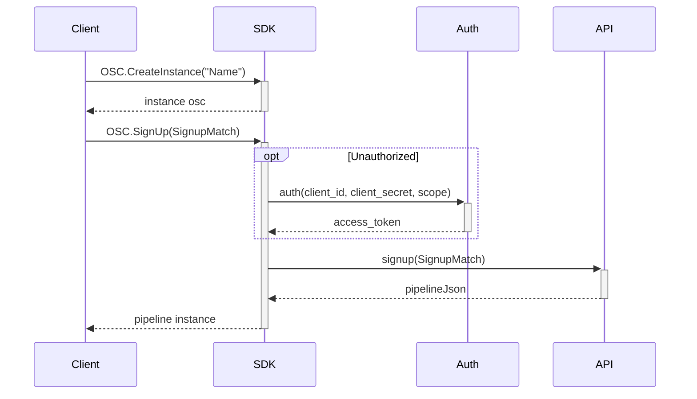
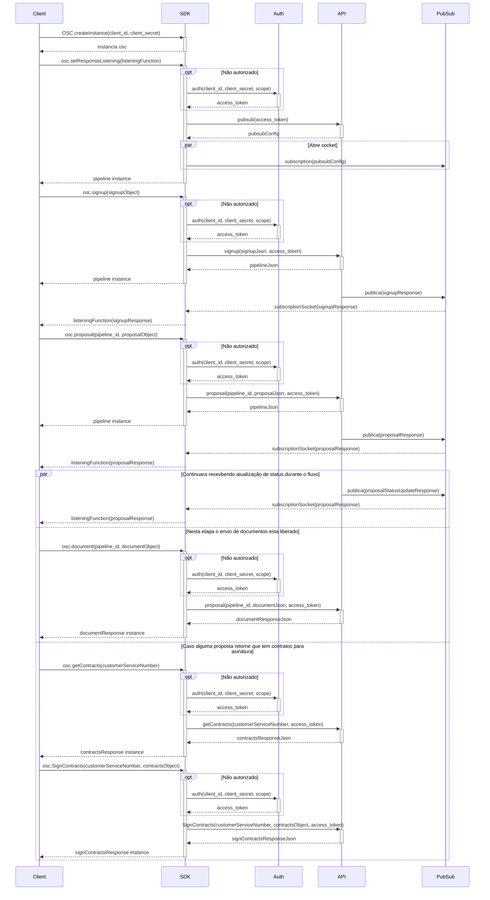

# Getting Started

Welcome to the OSC SDK C# project.

## Description

This documentation is made to help developers better understand its structures and methods, here you will have a deep dive into each method thoroughly with a simple yet complete explanation. For any problems, questions and/or issues, please create a new issue on the issues tab and the team will try to respond it as soon as possible.

## Folder Structure

The workspace contains three main folders, where:

- `./Requests`: This is the Integration layer, here you will find all the requests to external APIs;
- `./Utils`: This is the support layer, here you will find the methods that are used to help and/or clean the overall code from the SDK;
- `./src`: This is the Enumeration and Domain layer, here you will find the Objects and Enums that the SDK utilizes throughout its code structure;

for the subfolders, it is divided into the following structure:

- `./src/Enums`: This is where all the Enums and Dictionaries are located;
- `./src/Models`: This is where all the Domains and Objects are located; (currently being refactored)
- `./src/Models/Responses`: This is where the Objects that are used to map requisition responses are located;
- `.src/Models/Requests`: This is where the Objects that are used to map requisition requests are located;
- `.src/Models/SubDomains`: This is where the Objects that are used to build other Objects are located;
<details>
  <summary><h4>Complete folder structure:</h4></summary>
  
```
📦osc-sdk-csharp
 ┣ 📂osc-sdk-csharp
 ┃ ┣ 📂bin
 ┃ ┃ ┗ 📂Debug
 ┃ ┃ ┃ ┗ 📂net6.0
 ┃ ┃ ┃ ┃ ┣ 📜osc-sdk-csharp.deps.json
 ┃ ┃ ┃ ┃ ┣ 📜osc-sdk-csharp.dll
 ┃ ┃ ┃ ┃ ┗ 📜osc-sdk-csharp.pdb
 ┃ ┣ 📂obj
 ┃ ┃ ┣ 📂Debug
 ┃ ┃ ┃ ┗ 📂net6.0
 ┃ ┃ ┃ ┃ ┣ 📂ref
 ┃ ┃ ┃ ┃ ┃ ┗ 📜osc-sdk-csharp.dll
 ┃ ┃ ┃ ┃ ┣ 📂refint
 ┃ ┃ ┃ ┃ ┃ ┗ 📜osc-sdk-csharp.dll
 ┃ ┃ ┃ ┃ ┣ 📜.NETCoreApp,Version=v6.0.AssemblyAttributes.cs
 ┃ ┃ ┃ ┃ ┣ 📜osc-sdk-csharp.AssemblyInfo.cs
 ┃ ┃ ┃ ┃ ┣ 📜osc-sdk-csharp.AssemblyInfoInputs.cache
 ┃ ┃ ┃ ┃ ┣ 📜osc-sdk-csharp.assets.cache
 ┃ ┃ ┃ ┃ ┣ 📜osc-sdk-csharp.csproj.AssemblyReference.cache
 ┃ ┃ ┃ ┃ ┣ 📜osc-sdk-csharp.csproj.BuildWithSkipAnalyzers
 ┃ ┃ ┃ ┃ ┣ 📜osc-sdk-csharp.csproj.CoreCompileInputs.cache
 ┃ ┃ ┃ ┃ ┣ 📜osc-sdk-csharp.csproj.FileListAbsolute.txt
 ┃ ┃ ┃ ┃ ┣ 📜osc-sdk-csharp.dll
 ┃ ┃ ┃ ┃ ┣ 📜osc-sdk-csharp.GeneratedMSBuildEditorConfig.editorconfig
 ┃ ┃ ┃ ┃ ┣ 📜osc-sdk-csharp.GlobalUsings.g.cs
 ┃ ┃ ┃ ┃ ┗ 📜osc-sdk-csharp.pdb
 ┃ ┃ ┣ 📜osc-sdk-csharp.csproj.nuget.dgspec.json
 ┃ ┃ ┣ 📜osc-sdk-csharp.csproj.nuget.g.props
 ┃ ┃ ┣ 📜osc-sdk-csharp.csproj.nuget.g.targets
 ┃ ┃ ┣ 📜project.assets.json
 ┃ ┃ ┗ 📜project.nuget.cache
 ┃ ┣ 📂Requests
 ┃ ┃ ┣ 📜OAuth.cs
 ┃ ┃ ┣ 📜OContract.cs
 ┃ ┃ ┣ 📜ODocument.cs
 ┃ ┃ ┣ 📜OProposal.cs
 ┃ ┃ ┣ 📜OPubSub.cs
 ┃ ┃ ┗ 📜OSignUp.cs
 ┃ ┣ 📂src
 ┃ ┃ ┣ 📂Enums
 ┃ ┃ ┃ ┣ 📜AccountType.cs
 ┃ ┃ ┃ ┣ 📜Banks.cs
 ┃ ┃ ┃ ┣ 📜CreditCardBenefits.cs
 ┃ ┃ ┃ ┣ 📜CreditStatus.cs
 ┃ ┃ ┃ ┣ 📜DocumentType.cs
 ┃ ┃ ┃ ┣ 📜Education.cs
 ┃ ┃ ┃ ┣ 📜EmploymentSince.cs
 ┃ ┃ ┃ ┣ 📜Gender.cs
 ┃ ┃ ┃ ┣ 📜HomeSince.cs
 ┃ ┃ ┃ ┣ 📜HomeType.cs
 ┃ ┃ ┃ ┣ 📜IdentityIssuer.cs
 ┃ ┃ ┃ ┣ 📜IdentityType.cs
 ┃ ┃ ┃ ┣ 📜LoanObjectives.cs
 ┃ ┃ ┃ ┣ 📜MimeType.cs
 ┃ ┃ ┃ ┣ 📜Nationality.cs
 ┃ ┃ ┃ ┣ 📜Network.cs
 ┃ ┃ ┃ ┣ 📜Occupation.cs
 ┃ ┃ ┃ ┣ 📜PendentDocuments.cs
 ┃ ┃ ┃ ┣ 📜ProductType.cs
 ┃ ┃ ┃ ┣ 📜RealEstateType.cs
 ┃ ┃ ┃ ┣ 📜RelationshipStatus.cs
 ┃ ┃ ┃ ┣ 📜Scopes.cs
 ┃ ┃ ┃ ┣ 📜State.cs
 ┃ ┃ ┃ ┗ 📜URLSettings.cs
 ┃ ┃ ┗ 📂Models
 ┃ ┃ ┃ ┣ 📂Requests
 ┃ ┃ ┃ ┃ ┣ 📜AuthRequest.cs
 ┃ ┃ ┃ ┃ ┣ 📜DocumentRequest.cs
 ┃ ┃ ┃ ┃ ┣ 📜ProposalRequest.cs
 ┃ ┃ ┃ ┃ ┣ 📜SignContractRequest.cs
 ┃ ┃ ┃ ┃ ┣ 📜SignupRequest.cs
 ┃ ┃ ┃ ┃ ┣ 📜SimpleProposalRequest.cs
 ┃ ┃ ┃ ┃ ┗ 📜SimpleSignupRequest.cs
 ┃ ┃ ┃ ┣ 📂Responses
 ┃ ┃ ┃ ┃ ┣ 📜AuthResponse.cs
 ┃ ┃ ┃ ┃ ┣ 📜DocumentResponse.cs
 ┃ ┃ ┃ ┃ ┣ 📜GetContractResponse.cs
 ┃ ┃ ┃ ┃ ┣ 📜Pipeline.cs
 ┃ ┃ ┃ ┃ ┣ 📜PubSubResponse.cs
 ┃ ┃ ┃ ┃ ┣ 📜SignContractResponse.cs
 ┃ ┃ ┃ ┃ ┗ 📜SignUpResponse.cs
 ┃ ┃ ┃ ┗ 📂SubDomains
 ┃ ┃ ┃ ┃ ┣ 📜Address.cs
 ┃ ┃ ┃ ┃ ┣ 📜Auto.cs
 ┃ ┃ ┃ ┃ ┣ 📜Bank.cs
 ┃ ┃ ┃ ┃ ┣ 📜BankAccount.cs
 ┃ ┃ ┃ ┃ ┣ 📜BorrowerInfo.cs
 ┃ ┃ ┃ ┃ ┣ 📜Business.cs
 ┃ ┃ ┃ ┃ ┣ 📜BusinessIncome.cs
 ┃ ┃ ┃ ┃ ┣ 📜Card.cs
 ┃ ┃ ┃ ┃ ┣ 📜ConsumerUnit.cs
 ┃ ┃ ┃ ┃ ┣ 📜ContractBody.cs
 ┃ ┃ ┃ ┃ ┣ 📜Credit.cs
 ┃ ┃ ┃ ┃ ┣ 📜Error.cs
 ┃ ┃ ┃ ┃ ┣ 📜ErrorField.cs
 ┃ ┃ ┃ ┃ ┣ 📜ErrorFields.cs
 ┃ ┃ ┃ ┃ ┣ 📜Home.cs
 ┃ ┃ ┃ ┃ ┣ 📜Identity.cs
 ┃ ┃ ┃ ┃ ┣ 📜Loan.cs
 ┃ ┃ ┃ ┃ ┣ 📜LogData.cs
 ┃ ┃ ┃ ┃ ┣ 📜Match.cs
 ┃ ┃ ┃ ┃ ┣ 📜MatchAuto.cs
 ┃ ┃ ┃ ┃ ┣ 📜MatchCard.cs
 ┃ ┃ ┃ ┃ ┣ 📜MatchHome.cs
 ┃ ┃ ┃ ┃ ┣ 📜MatchLoan.cs
 ┃ ┃ ┃ ┃ ┣ 📜PipelineMatchLoan.cs
 ┃ ┃ ┃ ┃ ┣ 📜PipelineWithBankAccountProposal.cs
 ┃ ┃ ┃ ┃ ┣ 📜PipelineWithProposal.cs
 ┃ ┃ ┃ ┃ ┣ 📜Product.cs
 ┃ ┃ ┃ ┃ ┣ 📜ProductAuto.cs
 ┃ ┃ ┃ ┃ ┣ 📜ProductBankAccount.cs
 ┃ ┃ ┃ ┃ ┣ 📜ProductCard.cs
 ┃ ┃ ┃ ┃ ┣ 📜ProductHome.cs
 ┃ ┃ ┃ ┃ ┣ 📜ProductLoan.cs
 ┃ ┃ ┃ ┃ ┣ 📜Products.cs
 ┃ ┃ ┃ ┃ ┣ 📜Proposals.cs
 ┃ ┃ ┃ ┃ ┣ 📜Reference.cs
 ┃ ┃ ┃ ┃ ┣ 📜ServiceAccount.cs
 ┃ ┃ ┃ ┃ ┣ 📜Vehicle.cs
 ┃ ┃ ┃ ┃ ┗ 📜VehicleInformation.cs
 ┃ ┣ 📂Utils
 ┃ ┃ ┗ 📜Validator.cs
 ┃ ┣ 📜osc-sdk-csharp.csproj
 ┃ ┗ 📜Osc.cs
 ┣ 📂tests
 ┃ ┣ 📂bin
 ┃ ┃ ┗ 📂Debug
 ┃ ┃ ┃ ┗ 📂net6.0
 ┃ ┃ ┃ ┃ ┗ 📜CoverletSourceRootsMapping
 ┃ ┣ 📂obj
 ┃ ┃ ┣ 📂Debug
 ┃ ┃ ┃ ┗ 📂net6.0
 ┃ ┃ ┃ ┃ ┣ 📂ref
 ┃ ┃ ┃ ┃ ┣ 📂refint
 ┃ ┃ ┃ ┃ ┣ 📜.NETCoreApp,Version=v6.0.AssemblyAttributes.cs
 ┃ ┃ ┃ ┃ ┣ 📜tests.AssemblyInfo.cs
 ┃ ┃ ┃ ┃ ┣ 📜tests.AssemblyInfoInputs.cache
 ┃ ┃ ┃ ┃ ┣ 📜tests.assets.cache
 ┃ ┃ ┃ ┃ ┣ 📜tests.csproj.AssemblyReference.cache
 ┃ ┃ ┃ ┃ ┣ 📜tests.GeneratedMSBuildEditorConfig.editorconfig
 ┃ ┃ ┃ ┃ ┗ 📜tests.GlobalUsings.g.cs
 ┃ ┃ ┣ 📜project.assets.json
 ┃ ┃ ┣ 📜project.nuget.cache
 ┃ ┃ ┣ 📜tests.csproj.nuget.dgspec.json
 ┃ ┃ ┣ 📜tests.csproj.nuget.g.props
 ┃ ┃ ┗ 📜tests.csproj.nuget.g.targets
 ┃ ┣ 📜OSCTests.cs
 ┃ ┣ 📜tests.csproj
 ┃ ┗ 📜Usings.cs
 ┣ 📜.gitattributes
 ┣ 📜.gitignore
 ┣ 📜osc-sdk-csharp.sln
 ┗ 📜README.md
```
</details>

## How to test the project:

To test this project, first a separate project will have to be created, since <b>.NET</b> does not support Class Libs to run independently. The following examples will show how to test it on a Console project:
<b>
<details>
<summary><h3>AUTH</h3></summary>

To test the Auth method, you will need to implement the following command:

```C#
namespace TestConsole;
internal class Class1
{
    public static void Main( )
    {
        Console.WriteLine(
            OSC.Auth( )
            );
    }
}
```

this will retrieve a response containing the token and expiration date as in the image below:


this response will allow you to have access to all of the other methods, as it automatically saves the token and expiration date to the code itself, also as long as the first auth is made, the code will automatically refresh and generate you a new token as soon as the previous one expires. <br>
<b>(Note: the token will not refresh if you stop compiling the project, since it uses RAM based data storage)</b>
</details>
<details>
<summary><h3>CREATE & GET INSTANCE</h3></summary>

To test the CreateInstance and GetInstance methods, you will need to implement the following commands:
```C#
namespace TestConsole;
internal class Class1
{
    public static void Main( )
    {
        OSC.CreateInstance( );

        Console.WriteLine(
            OSC.GetInstance( )
            );
    }
}
```
this will create a instance and return that same instance as in the image below:


this will allow the User to have one or multiple instances, making possible the management of credentials and/or blocking certain methods to certain users.
</details>
<details>
<summary><h3>GET TOKEN</h3></summary>

To test the GetToken method, you will need to implement the following command:
```C#
namespace TestConsole;
internal class Class1
{
    public static void Main( )
    {
        Console.WriteLine(
            OSC.GetToken( ) 
            );
    }
```
this will return your Auth token or generate a new token in case your current token has expired as in the image below:


this will allow the User to get their current token and expiration date at any moment, also it will refresh their token if the current one has expired.
</details>
<details>
<summary><h3>NORMALIZE</h3></summary>

To test the Normalize method, you will need to implement the following command:
```C#
namespace TestConsole;
internal class Class1
{
    public static void Main( )
    {
        Console.WriteLine(
            OSC.Normalize( )
            );
    }
}
```
this will return you the string given to the method without the uppercase letters and without special simbols as in the image below:


this will allow the User to clean strings for various uses in the code.
</details>
<details>
<summary><h3>SIGNUP & SIMPLE SIGNUP</h3></summary>

To test the SignUp method, you will need to implement the following command:
```C#
namespace TestConsole;
internal class Class1
{
    public static void Main( )
    {
        OSC.Auth( );
        
        OSC.CreateInstance( );
        
        List<Products> products = new List<Products>( );

        SignupMatch signUp = new SignupMatch( );

        Console.WriteLine(
            OSC.SignUp( signUp )
            );
    }
}
```
this will return you the information of the User's credit sign up as in the image below:


this will allow the User to have access to the Credit features given by the Easy Crédito API.
  
----
To test the SimpleSignUp method, you will need to implement the following command:
```C#
namespace TestConsole;
internal class Class1
{
    public static void Main( )
    {
        OSC.Auth( );
        
        OSC.CreateInstance( );
        
        SimpleSignup signUp = new SimpleSignup( );

        Console.WriteLine(
            OSC.SimpleSignUp( signUp )
            );
    }
}
```
this will return you the information of the User's credit sign up as in the image below:


this will allow the User to have access to the Credit features given by the Easy Crédito API.
</details>
  
---
<h3>SIGNUP & SIMPLE SIGNUP FLOWCHART:</h3>
  


---
<details>
<summary><h3>DOCUMENT</h3></summary>

To test the Document method, you will need to implement the following command:
```C#
namespace TestConsole;
internal class Class1
{
    public static void Main( )
    {
        OSC.Auth( );

        SimpleSignup signUp = new SimpleSignup( );

        var jsonResponse = OSC.SimpleSignUp( signUp );
        SignUpResponse response = JsonConvert.DeserializeObject<SignUpResponse>( jsonResponse )!;

        Document document = new Document( );

        Thread.Sleep(10 * 1000);

        Console.WriteLine(
            OSC.Document(
                document, 
                response.ID
                )
            );
    }
}
```
this will return your document url as in the image below:


this will allow the User to upload the required documents to the API and save them on the Easy Crédito server.
</details>
<details>
<summary><h3>PROPOSAL & SIMPLE PROPOSAL</h3></summary>

To test the Proposal method, you will need to implement the following command:
```C#
namespace TestConsole;
internal class Class1
{
    public static void Main( )
    {
        OSC.Auth( );

        SimpleSignup signUp = new SimpleSignup( );

        var jsonResponse = OSC.SimpleSignUp(signUp);
        SignUpResponse response = JsonConvert.DeserializeObject<SignUpResponse>(jsonResponse)!;

        Proposal proposal = new Proposal( );

        Thread.Sleep(10 * 1000);

        Console.WriteLine(
            OSC.Proposal(
                proposal, 
                response.ID
                )
            );
    }
}
```
this will return your proposal status as in the image below:


this will allow the User to send requests for credit proposals to the Easy Crédito API.
  
---
To test the SimpleProposal method, you will need to implement the following command:
```C#
namespace TestConsole;
internal class Class1
{
    public static void Main( )
    {
        OSC.Auth( );

        SimpleSignup signUp = new SimpleSignup( );

        var jsonResponse = OSC.SimpleSignUp(signUp);
        SignUpResponse response = JsonConvert.DeserializeObject<SignUpResponse>(jsonResponse)!;

        ProposalBankAccount simpleProposal = new ProposalBankAccount( );

        Thread.Sleep(10 * 1000);

        Console.WriteLine(
            OSC.Proposal(
                proposal, 
                response.ID
                )
            );
    }
}
```
this will return your proposal status as in the image below:
(Note: In the code above, the object "signUp" can be either SimpleSignup or SignupMatch)


this will allow the User to send requests for credit proposals to the Easy Crédito API.
</details>
  
---
<h3>SIGNUP + PROPOSAL FLOWCHART:</h3>
  


  ---
<details>
<summary><h3>PUB/SUB</h3></summary>

To test the GetPubSub method, you will need to implement the following command:
```C#
namespace TestConsole;
internal class Class1
{
    public static void Main( )
    {
        OSC.Auth( );

        Console.WriteLine(OSC.GetPubSub( ));
    }
}
```
this will return your Pub/Sub message
(note: Due to hardships in testing of the Pub/Sub, there is no images to show the results of testing)

this will allow the User to get the callbacks from the Google server.
  
---
To test the PostPubSub method, you will need to implement the following command:
```C#
namespace TestConsole;
internal class Class1
{
    [Obsolete]
    public static void Main( )
    {
        OSC.Auth( );

        PubSubResponse response = JsonConvert.DeserializeObject<PubSubResponse>(OSC.GetPubSub( ))!;

        Console.WriteLine(OSC.PostPubSub(response));
    }
}
```
this will send your message to the cloud
(note: Due to hardships in testing of the Pub/Sub, there is no images to show the results of testing)

this will allow the User to send callbacks to the Google server.
</details>
</b>

## References

1. https://developers.easycredito.com.br/
2. https://www.newtonsoft.com/json/help/html/Introduction.htm
3. https://cloud.google.com/pubsub/docs
4. https://learn.microsoft.com/en-us/dotnet/csharp/
5. https://learn.microsoft.com/en-us/dotnet/fundamentals/

## Other Projects:

1. https://github.com/Fitbank-Pagamentos-Eletronicos/osc-sdk-python
2. https://github.com/Fitbank-Pagamentos-Eletronicos/osc-sdk-nodejs
3. https://github.com/Fitbank-Pagamentos-Eletronicos/osc-sdk-go
4. https://github.com/Fitbank-Pagamentos-Eletronicos/osc-sdk-java
